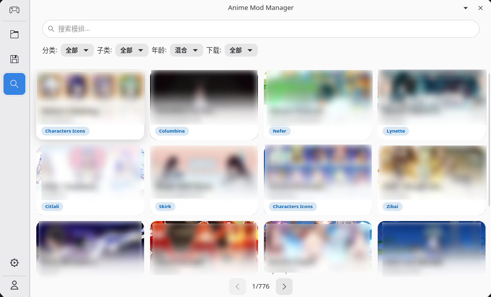
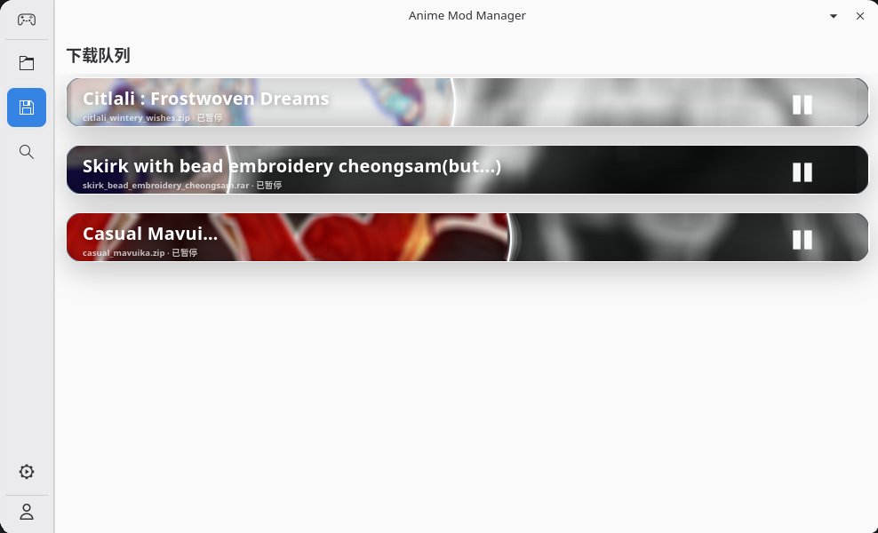
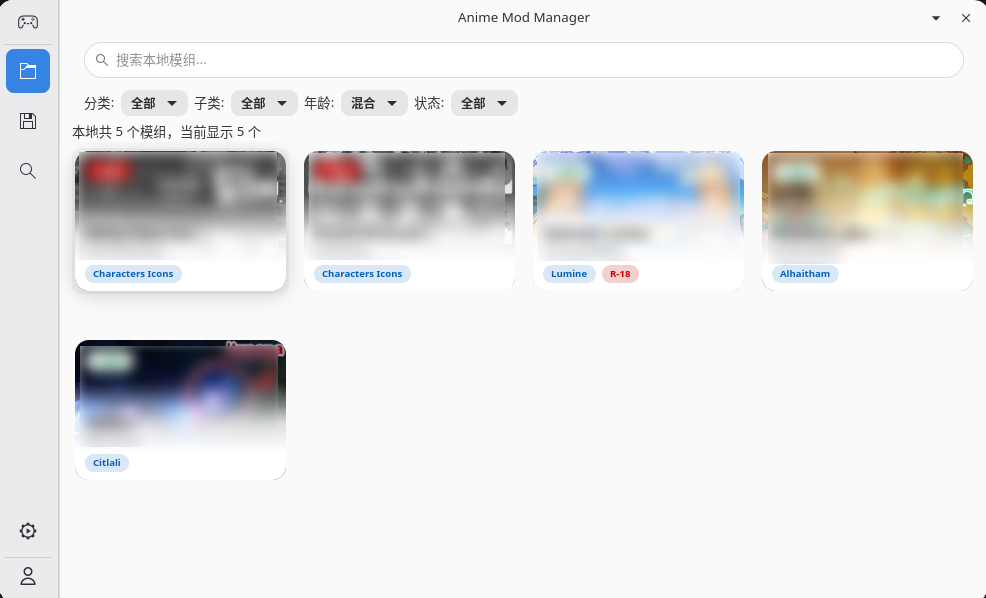
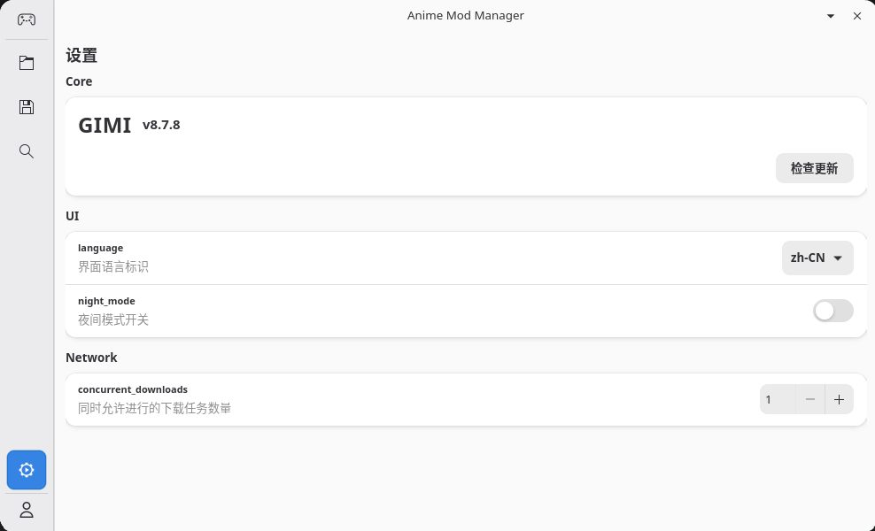

# Anime Mod Manager

## 项目

Anime Mod Manager 是一个面向 GIMI / 3dmigoto 模组工作流的桌面模组管理器。目前项目主要围绕 **Genshin Impact** 的 GameBanana 模组浏览、下载、安装和本地管理展开，核心库中也预留了 Honkai: Star Rail、Zenless Zone Zero、Wuthering Waves 等常见 GameBanana 游戏 ID。

项目由两部分组成：

- `anime-mod-manager`：Rust 核心库，负责 GameBanana API、下载、安装、缓存、本地模组元数据和模组启用状态。
- `mod-manager-demo`：基于 GTK4 / libadwaita 的桌面前端，用于提供完整的浏览、下载、本地管理和设置体验。

当前仓库更接近“可运行的桌面 demo + 可复用核心库”，还不是带安装器、自动更新和多平台打包的正式发行版。

### 软件截图

| 在线浏览与筛选 | 模组详情与版本选择 |
| --- | --- |
| [](assets/remote-browse.png) | [](assets/detail-drawer.png) |
| **下载队列** | **本地模组管理** |
| [](assets/download-queue.png) | [](assets/local-mods.png) |
| **设置** | |
| [](assets/settings.png) | |

### 适合谁使用

- 想在一个窗口里浏览、下载、安装和启停 GIMI 模组的普通用户。
- 想研究 GameBanana 模组下载、断点续传、本地 meta 索引和 GTK 桌面 UI 的 Rust 开发者。
- 想把模组管理能力接入其他桌面壳或工具链的开发者。

### 当前状态

- 默认前端目标游戏是 Genshin Impact。
- 前端配置文件统一使用 `config.json`。
- 本地模组和下载任务元数据保存在每个模组目录内的 `.anime-mod.json`。
- GIMI runtime 支持检查、下载和更新，默认来源为 `SilentNightSound/GIMI-Package`。

## 特点

- **从发现到安装的一体化流程**：在应用内浏览 GameBanana 模组、查看详情、选择文件版本、加入下载队列并安装到 GIMI `Mods` 目录。
- **面向不稳定网络的下载设计**：下载器支持 Range 续传、进度回调、取消检查、超时恢复和多类失败状态记录。
- **下载任务可恢复**：任务状态会写入 `.anime-mod.json`，应用重启后可以恢复未完成、暂停或失败的下载任务。
- **本地元数据按需读取**：`MetaManager` 只维护 `uuid -> 目录 / 模板类型` 索引，避免启动时一次性读入全部模组详情。
- **启用 / 禁用不破坏目录结构**：本地模组通过启用目录和禁用目录切换状态，保留模组自身文件和管理器元数据。
- **图片与封面缓存**：在线浏览和本地详情会复用已缓存的图片资源，减少重复请求。
- **运行时管理入口**：设置页提供 GIMI runtime 安装、版本检查和更新能力。
- **核心库与 UI 分离**：下载、安装、GameBanana API 和 meta 管理在核心库中，GTK 前端只是其中一个客户端。

## 功能

### 在线浏览

- 从 GameBanana 拉取模组列表。
- 支持分页、搜索、分类、子分类、年龄分级和下载状态筛选。
- 过滤非 Mod 类型提交，例如工具、教程和模组管理器条目。
- 展示作者、分类、点赞数、浏览数、封面和是否包含文件。

### 模组详情

- 通过右侧详情抽屉查看模组说明、预览图、作者、分类和更新时间。
- 展示可下载文件列表，包括文件名、大小、下载次数、MD5 和文件说明。
- 支持从详情页选择具体文件加入下载。

### 下载队列

- 支持多个下载任务排队执行。
- 支持设置并发下载数量，默认并发数为 `3`。
- 支持暂停、继续、失败重试和应用关闭时的任务状态保存。
- 下载阶段包含排队、下载中、安装中、完成、暂停和失败。
- 失败状态会细分为网络异常、续传范围无效、文件不存在、权限问题、格式不支持、解压/安装失败等。

### 本地模组管理

- 扫描 GIMI `Mods` 目录和禁用目录中的已管理模组。
- 查看本地已安装模组、封面、作者、分类和安装状态。
- 支持启用、禁用、搜索、筛选和批量操作。
- 安装时支持 `zip`、`7z`、`rar` 压缩包。
- 每个模组目录保留 `.anime-mod.json`，用于记录安装信息、远端信息、封面、当前文件名和下载 checkpoint。

### 设置与 GIMI Runtime

- 设置界面包含 Core、UI、Network 三类配置。
- 支持设置界面语言标识、夜间模式开关和下载并发数。
- 支持检查 GIMI runtime 最新版本。
- 支持下载或更新指定 GitHub release/tag 对应的 runtime 包。
- 默认 runtime 目录为应用运行目录下的 `gimi`，模组目录为 `gimi/Mods`。

## 使用方法

### 运行环境

需要先安装 Rust stable 和 Cargo。

桌面前端依赖 GTK4 与 libadwaita。Debian / Ubuntu 系发行版可以安装：

```bash
sudo apt install libgtk-4-dev libadwaita-1-dev
```

安装 `7z` / `rar` 模组压缩包时，系统还需要至少提供下面的解压工具之一：

- `7z`
- `bsdtar`

### 启动应用

在仓库根目录运行：

```bash
cargo run -p mod-manager-demo
```

启动后会打开 `Anime Mod Manager — Demo` 桌面窗口。

### 首次配置

1. 打开设置页。
2. 检查或安装 GIMI runtime。
3. 确认 runtime 目录下存在 `Mods` 目录。
4. 根据网络情况调整 `concurrent_downloads`。
5. 回到浏览页搜索或筛选模组，进入详情后选择文件下载。

### 常见工作流

1. 在“浏览”页查找 GameBanana 模组。
2. 打开详情抽屉，确认说明和文件版本。
3. 点击下载，任务会进入“下载”页。
4. 下载完成后应用会自动安装模组。
5. 在“本地”页启用、禁用或批量管理已安装模组。

### 配置文件

应用会在运行目录下生成 `config.json`。默认结构如下：

```json
{
  "core": {
    "gimi_runtime": {
      "importer_directory": "/path/to/app/gimi",
      "managed_version": "v8.7.8",
      "github_repo_owner": "SilentNightSound",
      "github_repo_name": "GIMI-Package"
    }
  },
  "ui": {
    "language": "zh-CN",
    "night_mode": false
  },
  "network": {
    "concurrent_downloads": 3
  }
}
```

字段说明：

- `core.gimi_runtime.importer_directory`：GIMI runtime 根目录。
- `core.gimi_runtime.managed_version`：期望安装或管理的 runtime 版本。
- `core.gimi_runtime.github_repo_owner`：runtime 包所在 GitHub 仓库 owner。
- `core.gimi_runtime.github_repo_name`：runtime 包所在 GitHub 仓库名。
- `ui.language`：界面语言标识，目前配置会保存，但完整多语言还在规划中。
- `ui.night_mode`：夜间模式开关，目前配置会保存，视觉主题完善仍在规划中。
- `network.concurrent_downloads`：最大并发下载任务数，最小值为 `1`。

### 本地数据位置

- 模组安装目录：`{importer_directory}/Mods`
- 禁用模组目录：由核心库根据 `Mods` 目录派生
- 模组元数据：每个已管理模组目录下的 `.anime-mod.json`
- 本地封面资源：每个模组目录下的 `.anime-mod-media/`
- GIMI runtime 版本标记：`{importer_directory}/.anime-mod-manager-version`

## 开发说明

### 项目结构

```text
.
├── src/                         # 核心库
│   ├── cache.rs                 # 通用缓存能力
│   ├── filter_data.rs           # 浏览筛选相关数据
│   ├── gamebanana.rs            # GameBanana API 客户端
│   ├── img_cache.rs             # 图片缓存
│   ├── manager.rs               # 本地模组安装、启用、禁用和 meta 写入
│   ├── meta_manager.rs          # .anime-mod.json 索引、读取和迁移
│   ├── mod_file_downloader.rs   # 基于 reqwest 的可续传文件下载器
│   └── models.rs                # API、下载、本地模组和 meta 数据模型
├── demo/
│   ├── src/config.rs            # config.json 配置读写
│   ├── src/main.rs              # GTK / libadwaita 应用入口
│   ├── src/style.css            # 前端样式
│   └── src/ui/                  # 浏览、下载、本地、设置和详情 UI
├── assets/                      # README 截图
├── Cargo.toml                   # workspace 根与核心库 manifest
└── demo/Cargo.toml              # 桌面 demo manifest
```

### 架构要点

- `GameBananaClient` 负责列表、详情和旧版文件下载接口。
- `ModFileDownloader` 是当前主要文件下载器，使用 `reqwest`、Range 请求和单线程 Tokio runtime。
- `ModManager` 负责准备下载目录、安装压缩包、写入模组 meta、启用/禁用和 legacy 数据迁移。
- `MetaManager` 负责扫描 meta roots、建立 uuid 索引、按模板类型读写 `.anime-mod.json`。
- `DownloadScheduler` 和 `DownloadModule` 位于 demo UI 层，负责队列、并发、暂停、恢复、重试和 UI 通知。
- `SettingsPage` 负责配置读写、下载并发设置以及 GIMI runtime 检查/安装/更新。

### 常用命令

格式化代码：

```bash
cargo fmt --all
```

检查核心库和桌面 demo：

```bash
cargo check -p anime-mod-manager
cargo check -p mod-manager-demo
```

运行桌面 demo：

```bash
cargo run -p mod-manager-demo
```

### 开发约定

- 新增持久化字段时优先为 serde 字段提供 `#[serde(default)]`，兼容旧 meta。
- 修改 `.anime-mod.json` 结构时，需要考虑 `MetaManager` 中的 legacy 迁移路径。
- 下载状态码集中定义在 `models.rs`，UI 展示和恢复逻辑应复用同一套状态码。
- 安装逻辑应避免删除管理器自己的 meta 和 media 文件。
- 新增 UI 功能时，优先让核心能力留在 `src/`，避免把可复用逻辑写死在 `demo/src/ui/`。

### 未来开发计划

- 提供正式打包与发布流程，例如 Linux AppImage / Flatpak，以及后续可能的 Windows 构建。
- 完善多语言系统，让 `ui.language` 真正驱动界面文本。
- 完善夜间模式，让 `ui.night_mode` 对应用主题立即生效。
- 增加更多游戏的前端选择入口，而不是只在核心库中保留 game id。
- 增加更新检测：对比本地 `remote_date_modified` 与远端模组更新时间，提示已安装模组可更新。
- 增强下载任务管理：删除任务、清理失败任务、批量暂停/继续和更明确的错误修复建议。
- 增加自动化测试，覆盖 meta 迁移、安装目录处理、下载状态恢复和 GameBanana 响应解析。
- 增加发布文档和用户故障排查文档，降低 GTK 依赖、解压工具和网络问题带来的上手成本。

### 许可证

MIT
